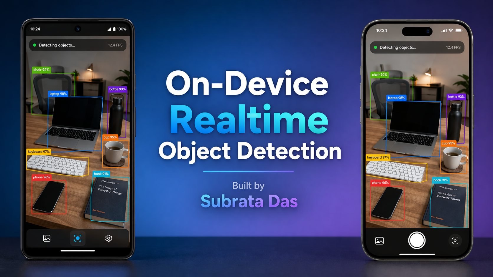

# 🚀 On-Device AI Introduction: Real-Time Object Detection App

Build the next generation of mobile apps with real-time, serverless intelligence.
Have you ever wanted to build apps that "see" and "understand" the world in real-time? Usually, this requires expensive cloud GPUs, complex APIs, and high latency. Not anymore.
With the arrival of ExecuTorch, Meta’s cutting-edge on-device AI engine, you can now run industry-standard PyTorch models directly on a user’s phone. No internet required. Zero latency. Total privacy.

## Why join this course?
In this micro-course, we strip away the academic jargon and get straight to building. You’ll go from "What is a tensor?" to deploying a Real-Time Object Detection app that identifies objects at lightning speed using your phone's camera.

* Native Performance: Leverage the power of C++ and the New Architecture in React Native.
* Production Ready: Learn the workflow used by top-tier engineering teams at Meta and Software Mansion.
* Portfolio Gold: Build a high-impact AI project that stands out in the crowded React Native job market.

------------------------------
## 📚 Course Curriculum

## Phase 1: The "Why" & The "How"

* Ch 1: The ExecuTorch Revolution
* Why on-device AI is the future (Privacy + Cost + Speed).
   * ExecuTorch vs. PyTorch Mobile: What has changed?
* Ch 2: Object Detection Decoded
* How computers "see": Bounding boxes and confidence scores.
   * Use cases: From automated retail to smart accessibility tools.

## Phase 2: Environment & Architecture

* Ch 3: Setting Up Your AI Lab
* Configuring the React Native New Architecture (Turbo Modules).
   * Installing react-native-executorch and its dependencies.
* Ch 4: Understanding the .pte Model
* How models are serialized for mobile.
   * Integrating the pre-trained detection model into your app bundle.

## Phase 3: The Build (Hands-on Lab)

* Ch 5: Framing the Vision
* Setting up the Camera preview with react-native-vision-camera.
   * Connecting the camera stream to the ExecuTorch engine.
* Ch 6: Live Inference & UI
* Processing frames in real-time.
   * Rendering high-performance bounding box overlays with React Native.
* Ch 7: Optimization & Debugging
* Handling device-specific performance (iOS vs. Android).
   * Best practices for smooth 30+ FPS animations.

## Phase 4: Beyond the Basics

* Ch 8: Graduation & Next Steps
* Where to find more models.
   * Deploying your AI-powered app to the world.

------------------------------
